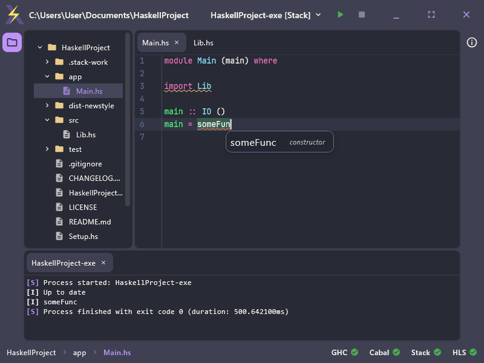
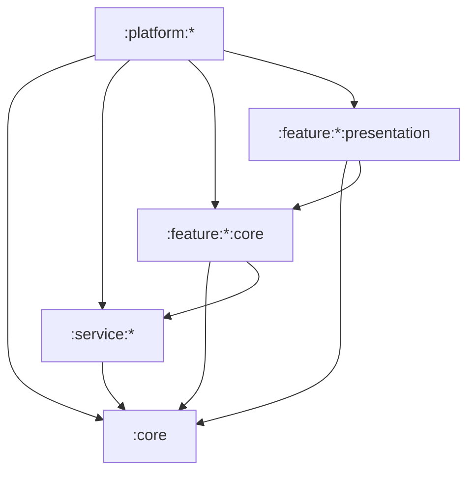

<h1 align="center" title="A lightweight and standalone Haskell IDE powered by Compose Desktop">haskcore</h1>

 

A lightweight and standalone Haskell IDE powered by Compose Desktop

## About

*My mission is to create the only Haskell IDE that is comfortable and contains all the necessary features to effectively
work with the language, whether you're a beginner or not.*

 

  <table border="0" cellpadding="0" cellspacing="0">
    <tr>
      <td align="center" valign="middle" style="border: none; padding-right: 20px;">
        
      </td>
      <td align="left" valign="middle" style="border: none;">
        <b style="font-size: 1.2em;">Support the development</b>
         
         
        <a href="https://numq.github.io/support" style="text-decoration: none;">
          <code style="color: #7aa2f7;">numq.github.io/support</code>
        </a>
      </td>
    </tr>
  </table>

## Features

- A text editor built from scratch using a rope buffer and rendered with Skia

- Syntax highlighting with Tree-sitter

- Built-in Dracula and Alucard color schemes

- HLS (LSP) support

- GHC, Cabal, and Stack support

- Multi-window support

## Contribution

The project is being developed solo and requires no contributions. You can contribute to its development by leaving
feedback or making a [donation](https://numq.github.io/support).

## Architecture

> [!NOTE]
> The application was designed using the [Reduce & Conquer](https://github.com/numq/reduce-and-conquer) architectural
> pattern

This project follows a highly modularized, layered architecture designed for strict isolation, testability, and
scalability.

