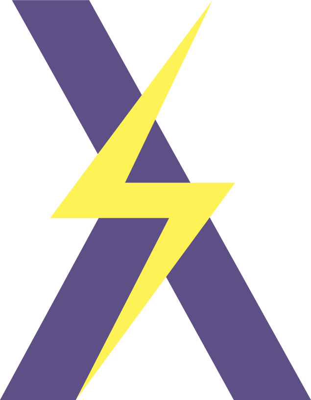
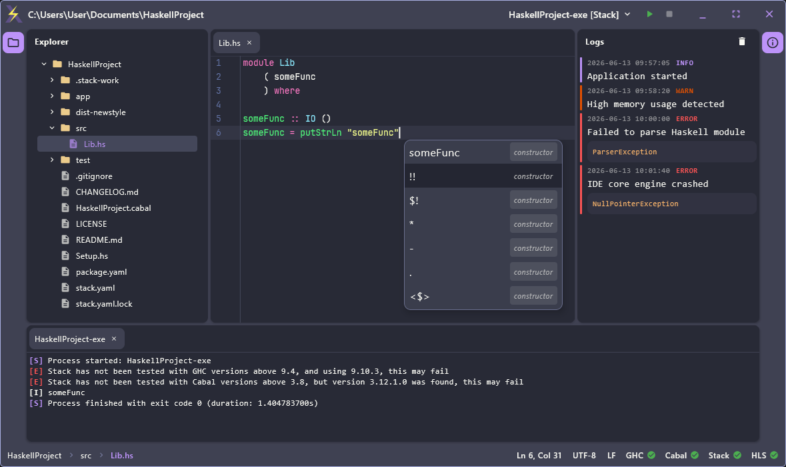

  

<h1 align="center">haskcore</h1>

  <strong>Haskell Development, Refined.</strong> 
  A lightweight, zero-config IDE built to make Haskell accessible for beginners and powerful for pros.

  

---

## 🚀 Why haskcore?

Haskell is a beautiful language, but the entry barrier is often raised by "setup hell" and brittle plugin configurations. **haskcore** is a standalone, purpose-built environment designed to get you from zero to code in seconds.

### 🐣 For Beginners: Simplify the Start
Forget about manual path configurations, conflicting extensions, or broken environments. **haskcore** comes with everything integrated. GHC, Cabal, and Stack support work out of the box, allowing you to focus on learning the language, not the tools.

### ⚡ For Pros: Beyond Plugins
Tired of the lag and memory bloat of Electron-based editors? Tired of your Haskell setup breaking after a plugin update? haskcore provides a **native, standalone experience**. It’s faster, more stable, and deeply optimized for the Haskell ecosystem. No more fighting with a dozen separate plugins.

---

## ✨ Key Features

*   **⚡ Native Performance:** A custom text editor engine built from scratch using a **rope buffer** and rendered with **Skia**. Experience the responsiveness of a native application without the overhead of a browser engine.
*   **🧩 Battery Included:** First-class support for **GHC, Cabal, and Stack**. It’s not just an editor; it's a complete Haskell workspace.
*   **🔍 Precise Highlighting:** Powered by **Tree-sitter** for lightning-fast and accurate syntax highlighting that understands the structure of your code.
*   **🛠 Smart Development:** Deep **LSP (HLS)** integration providing reliable code completion, real-time diagnostics, and safe refactorings.
*   **🪟 Productive Workspace:** True multi-window support and a clean, distraction-free interface built with **Compose Desktop**.
*   **🎨 Aesthetics:** Beautiful built-in **Dracula** and **Alucard** themes to keep your eyes fresh during long sessions.

---

## 🛠 Tech Stack

Built with a focus on modern, high-performance desktop technologies:
- **Kotlin & Compose Desktop** — For a reactive and responsive UI.
- **Skia** — For hardware-accelerated text and graphics rendering.
- **Tree-sitter** — For deep, incremental code analysis.
- **Architecture** — Leveraging [FLIP](https://github.com/numq/flip) and [Reduce & Conquer](https://github.com/numq/reduce-and-conquer) patterns.

---

## 🤝 Support the Mission

haskcore is a solo project dedicated to creating the most comfortable Haskell development environment. Your feedback and support are vital to keep the project moving forward.

> [!TIP]
> You can support the development by sharing your thoughts in the [Issues](https://github.com/numq/haskcore/issues) or by making a [donation](https://numq.github.io/support).

---

## 📜 License

Licensed under the [GNU General Public License v3.0](LICENSE).  
For commercial licensing inquiries, please reach out via email.

---

  
   
  <a href="https://numq.github.io/support" style="text-decoration: none;">
    <code>Support Development: numq.github.io/support</code>
  </a>

